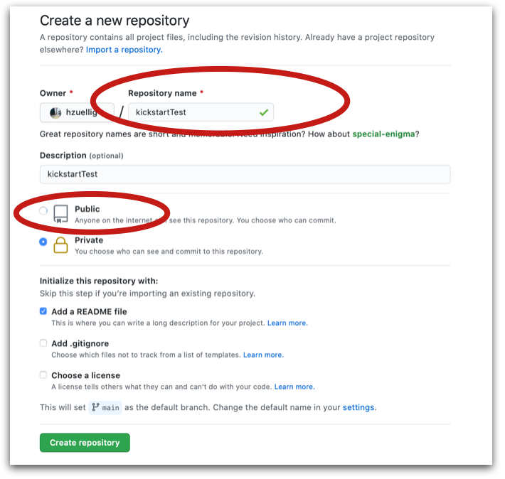
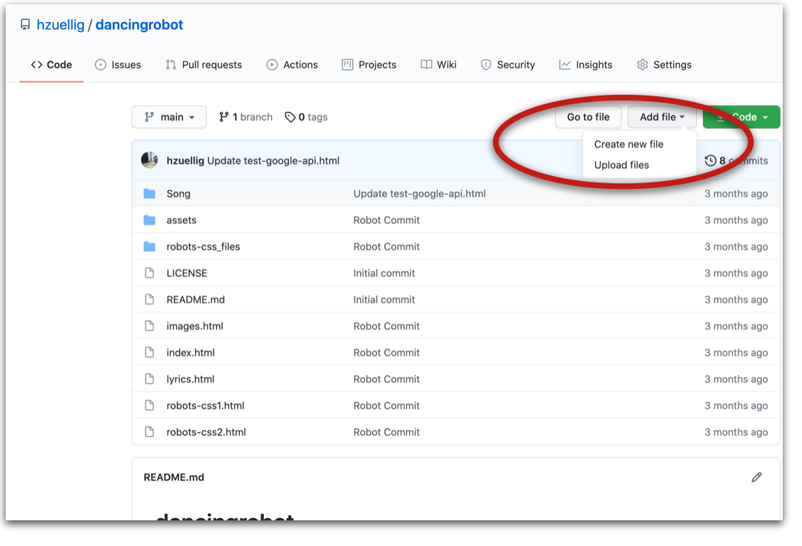
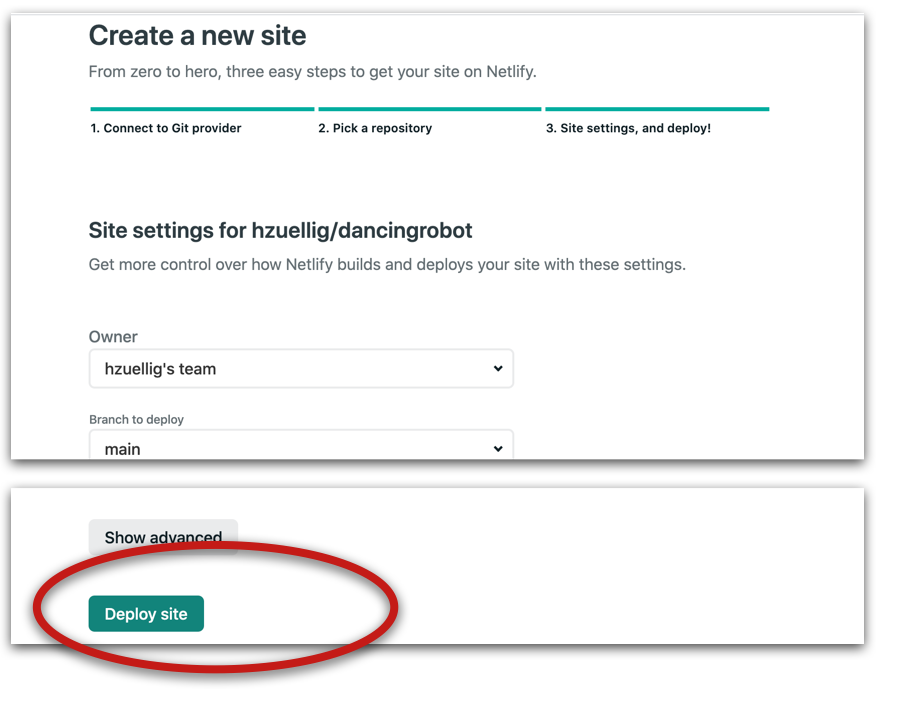
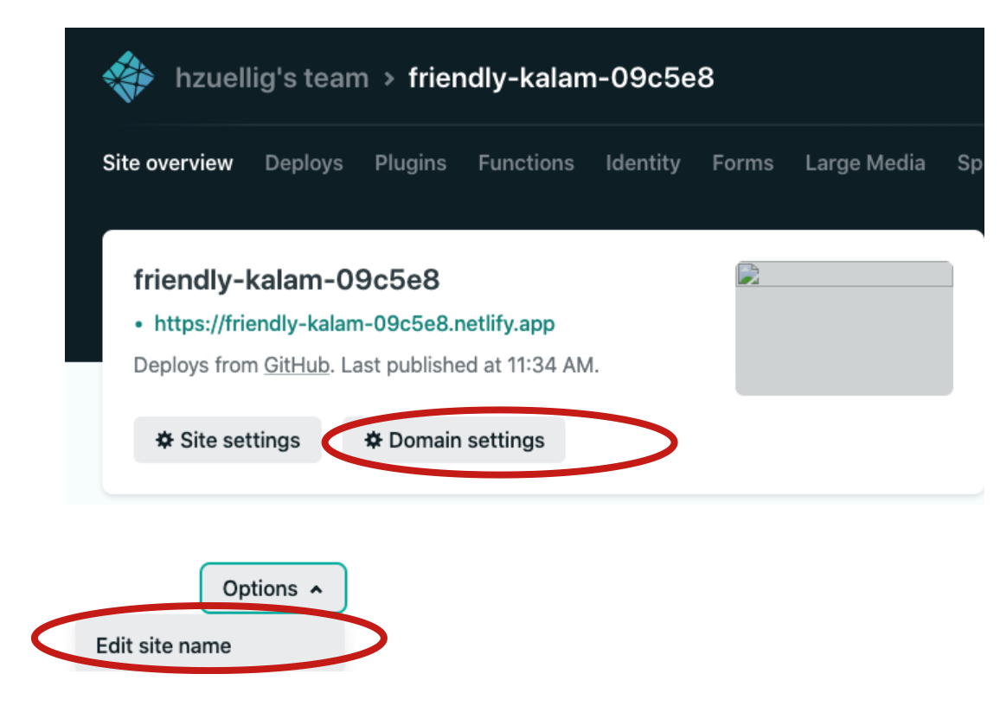
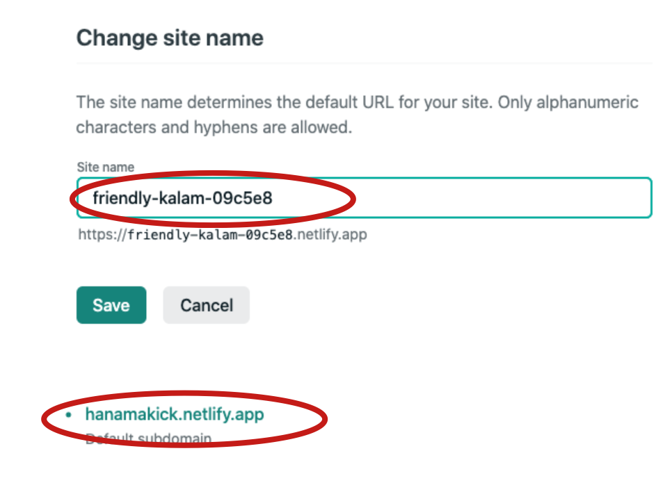
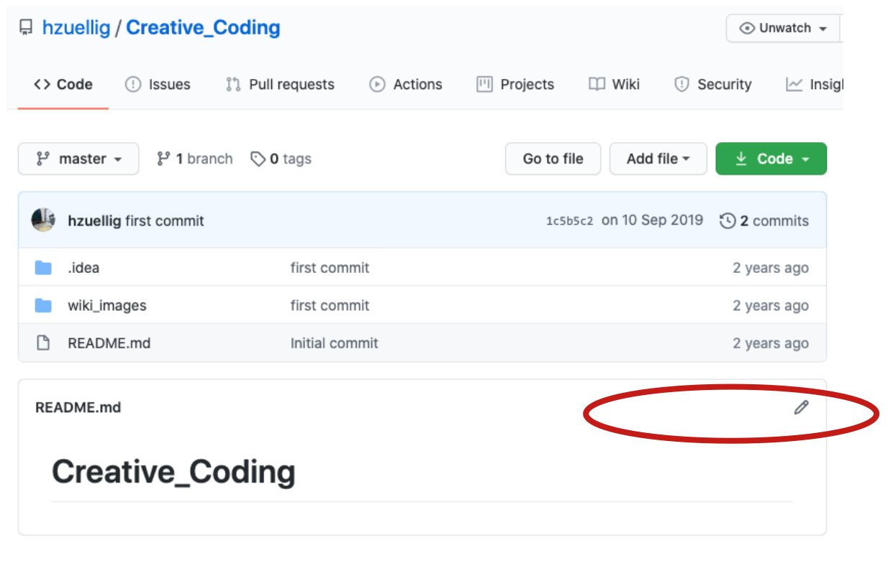

# Deployment 

## Aufbau Prozess Seite, Beispiel
* https://ida2021-staging.netlify.app/surya_schmid/
* https://ida2022.netlify.app/
* https://annakleger.netlify.app/

Wichtig, alle Bilder, alle Files, alle Fonts – kurzum alle Ressourcen, die Teil eurer Prozess Seite sind, gehören in eine übergeordnete Folderstruktur. 
```
colaborprozess_hanna 
│   index.html (diese Seite wird angezeigt, von hier wird alles verlinkt)
└───tag1
│   │   uebungen.html
│   └───ueb1
│   │    │  ueb-1.html
│   │    │  sketch1.js
│   └───ueb2
│   │    │  ueb-2.html
│   │    │  sketch2.js
│ 
└───tag2
│   │   uebungen.html
│   ...
│   
└───sprint1 (sprint 1 in einem subfolder)
│   │   index.html
│   └───pages
│   │   │   page1.html
│   │   │   page2.html
│   └───css
│   │   │   main.css
│   │   │   font.woff2
│   │
│   └─── images
│   │   │   img1.jpg
│   │   │   img2.jpg
│   │   ...


```

Beachtet, dass Design Ressourcen, schwere Layout Files, hochaufgelöste Bilder oder Fonts, die ihr nicht braucht, nicht auf den Webserver geladen werden. 
Ihr könnt dafür lokal einen separaten Order `resources` anlegen und die Ressourcen dorthin verschieben. 


## Einfaches Veröffentlichen auf Github - Netlify (individuelle Repos)
Loggt euch ein auf https://github.com/ oder kreiert einen Account mit eurer @stud.hslu.ch Adresse (gratis). <br/>

Tutorial: https://vimeo.com/572470155<br/>

Erstelle auf Github ein neues Repository: colaborprozess_(eurername). Setze es auf Public. <br/>
 <br/>

Lade den Inhalt deines lokalen colaborprozess_(eurername) Folders in das Repo.   <br/>
 <br/>
Über den Dienst von Netlify kannst du dein Github Repo verknüpfen und öffentlich sichtbar machen, wie die Applikation ausschaut. Nach jedem push können die Anpassungen präsentiert werden. Geht auf https://www.netlify.com/ und loggt euch ein mit euren Github Daten.   <br/>

In der Team Overview Seite klickt ihr auf ‚New Site from Git‘ und wählt Github aus. Netlify greift dann auf eure Repos zu. Wählt euer Repo aus und wählt `<Deploy Site>`.
<br/>
 <br/>

In der Site overview klickst du auf Domain Settings. In der Folgeseite klickst du auf Options und wählst `Edit site name`. 
<br/>
 <br/>

Hier kannst du einen selbstgewählten Namen eingeben. Über diese URL kannst du deine Arbeiten präsentieren. Jede Änderung, die du auf Github pushst, wird hier automatisch sichtbar.
<br/>
 <br/>
Zurück auf deinem Github Repo kannst du das Readme File anpassen und deine Netlify URL einfügen. 
<br/>
 <br/>