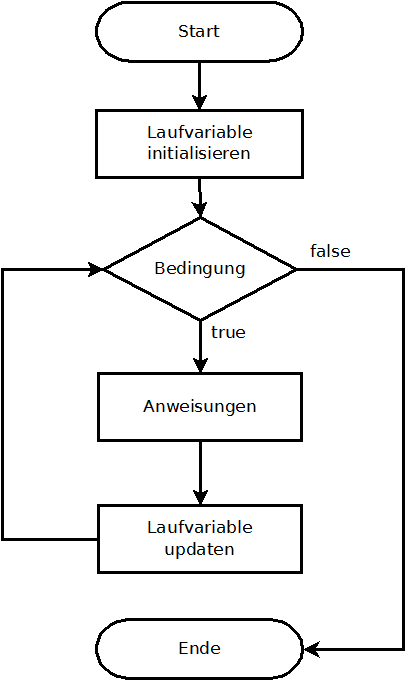
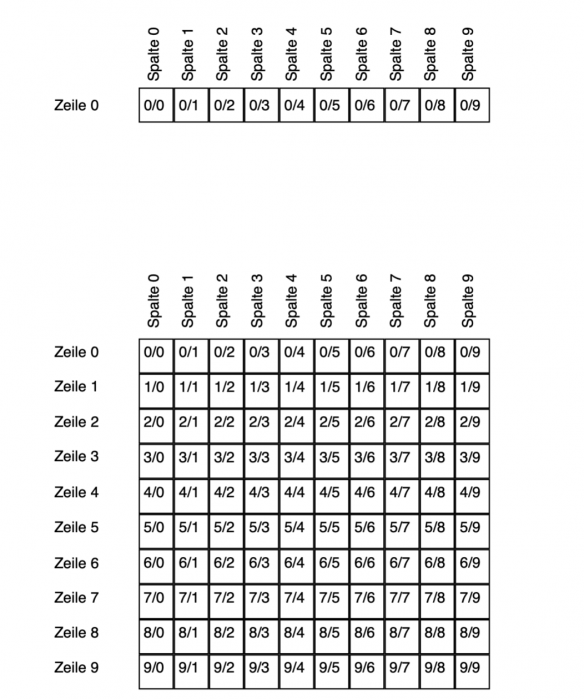
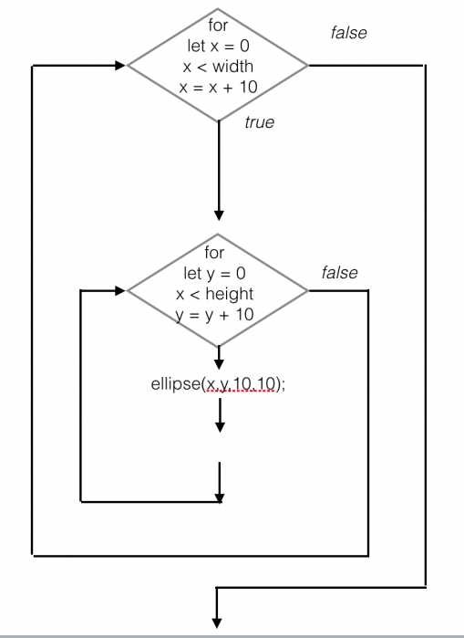

# Der einfache Loop (Schleifen)
<a href="https://thecodingtrain.com/tracks/code-programming-with-p5-js/code/4-loops/1-while-for">Daniel Shiffmann erklärt einfache Schleifen</a>  
Anmerkung: Die Loop oder Schleifenstruktur, die innerhalb von p5 verwendet wird, ist identisch zu der, die in purem JS verwendet wird. 

## Schleifen und Schleifen: zeitlich und räumlich
Die Funktion `draw()` funktioniert als zeitliche Endlosschleife. Nehmen wir an, wir zeichnen einen Pixel von links nach rechts auf dem Bildschirm. Wir möchten als den horizontalen Pixelwert bei jedem Durchlaufen der Schleife um 1 erhöhen. [Beispiel](https://editor.p5js.org/hzuellig/sketches/9WDhrYypG)
Die Zeit für einen Durchlauf der draw Funktion hängt von verschiedenen Faktoren ab (Prozessor-Geschwindigkeit, Browser, etc..), aber per Standard-Einstellung versucht p5js 60 mal pro Sekunde auf den Canvas zu zeichnen. Wir können die Geschwindigkeit allerdings mit einem Programmierbefehl `frameRate()` selbst einstellen. Innerhalb der Klammern (das Argument) steht die Anzahl der Frames pro Sekunde: 
Dabei zeichnet p5js in jedem Durchlauf bloss einen einzigen Pixel. Dies wird klar, wenn die Funktion `background()` in den `draw()` Loop eingefügt wird. 
Möchtet ihr jedoch eine Form in einem einzigen Frame mehrfach gezeichnet haben, so braucht ihr ein neues Programmierkonzept: Schleifen.

Schaut euch einmal dieses [Beispiel](https://editor.p5js.org/hzuellig/sketches/UoEpeDeKj) an.  
Wir zeichnen hier eine vertikale Linie in regelmässigem Abstand.  
Wir eine Variable und zählen diese in Schritten hoch, hier um 20 Pixel. Diese benutzen wir für die x-Position.  
Wenn ihr den Code anschaut, so seht ihr, dass sich diese beiden Befehle immer wiederholen: 
`x=x+20;` 
`line(x,0,x,height);` 

Wir schauen uns nun an, wie wir diesen Code einfacher schreiben könnten. Es gibt zwei Arten, wie man die Terminierung (=wann ist sie fertig?) von Schleifen beschreiben kann: in der `while` Schleife ist nicht bekannt, wie **oft** die Schleife laufen soll – es ist bloss die Abbruchbedingung bekannt. 
In der `for` Schleife ist bekannt, wie oft die Schleife laufen soll. Wir schauen uns die beiden Arten an und schreiben das Beispiel oben um. 

## while
Pseudocode: 
`while (CONDITION) {`  
  `// Teil der Schleife`  
`}` 
Das `while` bezieht sich auf den Codeblock zwischen den {} Klammern. Dieser wird solange ausgeführt solange die Kondition in den runden Klammern () wahr ist. Sprichwörtlich: Tue es, solange die Kondition zutrifft. In unserem Beispiel führen wir eine neue Variable `i` ein, welche wir als Zähler verwenden. `i` wird in jedem Durchlauf um 10 erhöht, solange es kleiner als die Höhe des Sketches ist (die Bedingung in den Klammern des while Statements). 
[Beispiel](https://editor.p5js.org/hzuellig/sketches/v-fpEF_me)

## for
Bevor wir uns diese im Detail anschauen, überlegen wir, welche Angaben wir dazu brauchen. Wenn du zum Beispiel 10 Liegestützen machen musst, so zählst du mit 1,2,3,4,5.... bis 10. Schauen wir uns das genauer an, so sehen wir da drei Angaben.  
1. Angabe: wo beginnst du zu zählen? Theoretisch könntest du auch bei 10 oder 11 beginnen und von dort hochzählen.  
2. Angabe: wann hörst du auf? Wenn du etwas nicht unendlich machen willst, brauchst du einen Schwellenwert. Wenn der überschritten ist, hört du auf. 
3. Angabe: um wieviel erhöhst du bei jedem Schritt? Hier erhöhst du um 1. Theoretisch könntest du auch so zählen: 1,3,5,7.... und dann bei 20 aufhören.  
Mit diesen drei Angaben haben wir nun die Konzepte angesehen, die wir auch für die for Schleife benötigten.  

In Programmiersprache sagt man: 
1. Angabe: wo beginnst du zu zählen? **Initialisierung der Laufvariable**. 
2. Angabe: wann hörst du auf? **Durchlauf-Bedingung**  
3. Angabe: um wieviel erhöhst du bei jedem Schritt? **Laufvariable updaten**  
In Pseudocode: 
`for (init; test; update) {` 
`// Teil der Schleife` 
`}`

 

 
Mit init deklarieren wir eine neue Variable, die im Schleifenblock for verwendet wird. Normalerweise verwenden wir den Variablennamen i, aber ihr könnt jeden anderen Namen dafür verwenden. Der mittlere Teil test prüft, ob die Variable i einen bestimmten Wert erreicht hat. Der letzte Teil update ändert den Variablenwert bei jedem Durchlauf (d.h. die Variable wird entweder erhöht oder verkleinert). Auf unsere vorherige Linienzeichnung angewendet, würde eine for-Schleife wie folgt aussehen:  
<a href="https://editor.p5js.org/hzuellig/sketches/g5Od3jCtM" target="_blank">Beispiel für eine for Schleife </a>  
Ihr seht, der Code wird durch das Schleifenkonstrukt einfacher und übersichtlicher.  

Um zu sehen was mit `i` bei jeder Iteration der Schleife passiert, schreibt mal ein `console.log(i)`; in den Schleifenblock.  

Die Kondition die man in den runden Klammern überprüft nennt man auch Durchlauf-Bedingung (relational expression). Es vergleicht zwei Werte (in unserem Fall i und die Grösse der Skizze eq. width) mit einem Vergleichsoperator. In unserem Beispiel haben wir `i < width` verwendet. Der Operator ist kleiner als  (<). Die gebräuchlichsten Operatoren sind dieselben wie bei den Bedingungen:
 
`<` Weniger als 
`<=` Kleiner oder gleich und kleiner als 
`>=` Grösser oder gleich und grösser als 
`>` Grösser als 
`!=` nicht gleich 
Die Durchlauf-Bedingung gibt immer true oder false zurück. Wir können uns bei jedem Durchlauf fragen: 

Ist i mit dem Wert 10 kleiner oder gleich width? Ja….. Schleife weitermachen. 
Ist i mit dem Wert 20 kleiner oder gleich width? Ja….. Schleife weitermachen. 
Ist i mit dem Wert 30 kleiner oder gleich width? Ja….. Schleife weitermachen. 
… 10, 20, 30, 40, 50, 60, 70, 80, etc….. Ja….. Schleife weitermachen. 
Ist i mit dem Wert 400 kleiner oder gleich 400 (width ist auf 400 gesetzt)? Ja….. Schleife weitermachen. 
Ist i mit dem Wert 410 kleiner oder gleich 400? Nein…. Stop 
Solange also die Bedingung wahr ist, wird die Schleife ausgeführt. Sobald die Bedingung falsch wird, wird der Code  innerhalb der Schleifenfunktion nicht mehr ausgeführt und die for-Schleife endet. 

# Der doppelte Loop (Verschachtelte Schleifen)
<a href="https://thecodingtrain.com/tracks/code-programming-with-p5-js/code/4-loops/2-nested">Daniel Shiffmann erklärt doppelte Schleifen</a>  

Ein Vorteil von Schleifen ist, dass man eine Schleife in eine andere einbetten kann. Wir schauen uns hier die x/y Koordinaten in einem Raster aus Zeilen und Spalten an. Der Einfachheit halber ist die Breite und Höhe eines Rasterelements auf 1 gesetzt.  
 
In einem Flussdiagramm sieht eine verschachtelte Schleife so aus:  
 
Schaut euch nochmals dieses Beispiel an: https://editor.p5js.org/hzuellig/sketches/ePH_txE9L
Wir haben hier eine einfache Schleife. Die Laufzeitvariable wird für die y-Position benutzt. Damit sich das Muster auch in der x-Richtung wiederholt, wird der Befehl in der Schleife wiederholt. Das könnte man einfacher lösen! 
Schaffst du es, das erste Beispiel so umzuschreiben, dass du eine doppelte Schleife benutzt? 