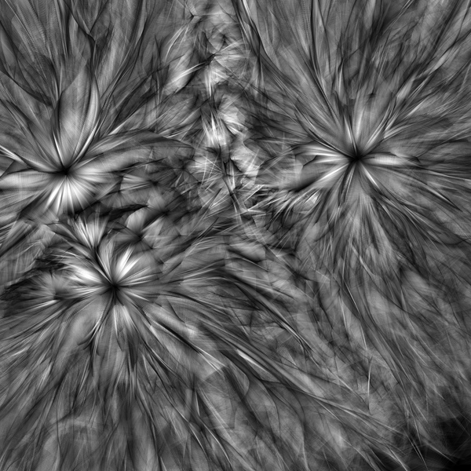

# Intro p5.js

## Detailseiten p5
* <a href="p5.md">The p5 World</a>
* <a href="variablen.md">Variablen </a>
* <a href="loop.md">Einfache Loops, Nested Loops</a>
* <a href="arrays.md">Arrays </a>
* <a href="github.md">Struktur Website, Github</a>
* <a href="exerciseMolnar.md">Exercise Molnar Pattern between order and disorder</a>
* <a href="p5SharingPot.md">More Exercises and Sharing</a>

*** 

## Artists
* http://dada.compart-bremen.de/
* https://whitney.org/exhibitions/programmed
* Georg Nees
* Frieder Nake
* Manfred Mohr
* Lucia di Luciano
* Vera Molnar
* Lilian F. Schwartz
* Joan Truckenbrod
* John Whitney
* Kenneth Knowlton
* Camille Utterback
* Charlotte Johanneson
* John Maeda
* Annie Albers 
* Bridget Riley
* Victor Vaserely
* ... 

## Recreate
https://rtp.media.mit.edu/

## Ressourcen
### Start
* https://p5js.org/
* Basic Concepts: https://cathyatseneca.gitbooks.io/coding-projects-with-p5-js/content/
* Daniel Shiffman Coding Train: https://thecodingtrain.com/tracks/code-programming-with-p5-js
* https://github.com/processing/p5.js/wiki
* Videotutorial Intro, Recreate Annie Albers: https://ha-ma-ct-21.netlify.app/videotutorials/
* https://github.com/mattdesl/workshop-p5-intro 
* http://www.generative-gestaltung.de/2/
* https://generativeartistry.com/tutorials/
* http://openhumanitiespress.org/books/download/Soon-Cox_2020_Aesthetic-Programming.pdf
* More Ressources, Books, Tutorials: https://github.com/terkelg/awesome-creative-coding#books

### Geometrie, Math
* Daniel Shiffman, The Nature of Code: https://wtf.tw/ref/shiffman.pdf and https://natureofcode.com/book/
* Coding Math Tutorials: https://www.youtube.com/user/codingmath
* Sinus und Cosinus visuell: https://setosa.io/ev/sine-and-cosine/
* Visualisierung von mathematischen Funktionen https://www.desmos.com/calculator/zukjgk9iry
* Oscillation: https://ffd8.github.io/oscillation-sandbox/
* http://victorjs.org/ Vektoren Berechnungen
* https://easings.net/  CSS Easing Functions in JavaScript

* Annie Albers  

* Bridget Riley  

* Vera Molnar 
 

* John Maeda
 

* Zdenek Sykora
 

* John Whitney, https://www.youtube.com/watch?v=TbV7loKp69s
 

* Casey Reas, https://vimeo.com/22063474
 

***

## Detailseiten p5
* <a href="p5.md">The p5 World</a>
* <a href="variablen.md">Variablen </a>
* <a href="loop.md">Einfache Loops, Nested Loops</a>
* <a href="arrays.md">Arrays </a>
* <a href="github.md">Struktur Website, Github</a>
* <a href="exerciseMolnar.md">Exercise Pattern between order and disorder</a>
* <a href="p5SharingPot.md">More Exercises and Sharing</a>
