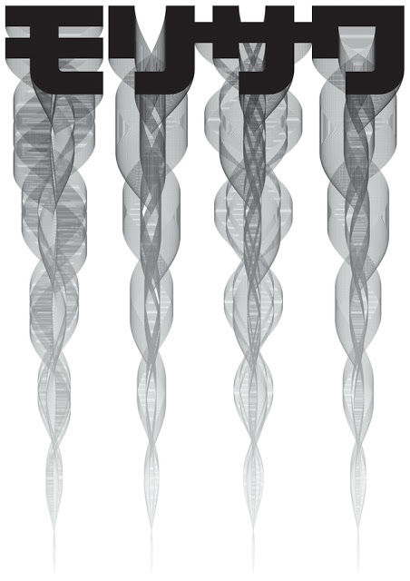
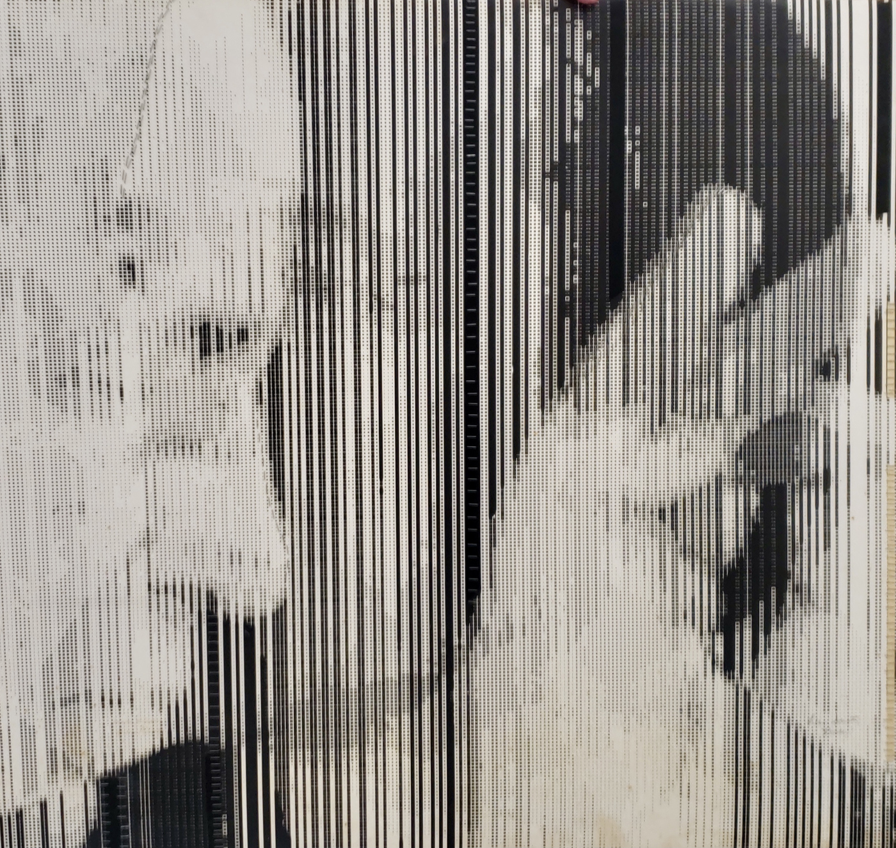
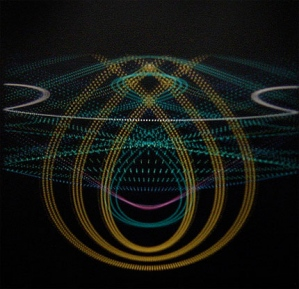

# Intro p5.js

## Detailseiten p5
* <a href="variablen.md">Variablen </a>
* <a href="loop.md">Einfache Loops, Nested Loops</a>
* <a href="arrays.md">Arrays </a>
* <a href="github.md">Struktur Website, Github</a>
* <a href="p5SharingPot.md">Exercises and Sharing</a>

*** 

## Artists
* Georg Nees
* Frieder Nake
* Manfred Mohr
* Lucia di Luciano
* Vera Molnar
* Lilian F. Schwartz
* Joan Truckenbrod
* John Whitney
* Kenneth Knowlton
* Camille Utterback
* Charlotte Johanneson
* John Maeda
* Annie Albers 
* Bridget Riley
* Victor Vaserely
* ... 

## Themen
Pattern, Pixel, Rules, Algorithmen 
* http://recodeproject.com/

## Ressourcen
### Start
* https://p5js.org/
* Basic Concepts: https://cathyatseneca.gitbooks.io/coding-projects-with-p5-js/content/
* Daniel Shiffman Coding Train: https://thecodingtrain.com/tracks/code-programming-with-p5-js
* https://github.com/processing/p5.js/wiki
* Videotutorial Intro, Recreate Annie Albers: https://ha-ma-ct-21.netlify.app/videotutorials/
* https://github.com/mattdesl/workshop-p5-intro 
* http://www.generative-gestaltung.de/2/
* https://generativeartistry.com/tutorials/
* https://github.com/ofZach/RTP_SFPC_SUMMER20
* http://openhumanitiespress.org/books/download/Soon-Cox_2020_Aesthetic-Programming.pdf
* More Ressources, Books, Tutorials: https://github.com/terkelg/awesome-creative-coding#books

### Geometrie, Math
* Daniel Shiffman, The Nature of Code: https://wtf.tw/ref/shiffman.pdf and https://natureofcode.com/book/
* Coding Math Tutorials: https://www.youtube.com/user/codingma
* Sinus und Cosinus visuell: https://setosa.io/ev/sine-and-cosine/
* Oscillation: https://ffd8.github.io/oscillation-sandbox/


## Muster und Algorithmen erkennen
* Sol Lewitt: https://solvingsol.com/
* Pseudo Programmiersprache: https://de.wikipedia.org/wiki/Pseudocode, https://editor.p5js.org/cs4all/sketches/Q-wzh3UAT, https://studyflix.de/informatik/pseudo-code-und-struktogramme-830  
* Truchet Tiles: https://en.wikipedia.org/wiki/Truchet_tiles
* Annie Albers <br/>

* Vera Molnar 
<br/>

* John Maeda
<br/>

* Lilian F. Schwartz
<br/>

* John Whitney, https://www.youtube.com/watch?v=TbV7loKp69s
<br/>



# p5.js Intro
<cite>p5.js is a JavaScript library for creative coding, with a focus on making coding accessible and inclusive for artists, designers, educators, beginners, and anyone else! Using the metaphor of a sketch, p5.js has a full set of drawing functionality. However, you’re not limited to your drawing canvas. You can think of your whole browser page as your sketch, including HTML5 objects for text, input, video, webcam, and sound. </cite>
(p5.js Website)

p5.js stellt euch eine Reihe von Funktionen zur Verfügung, die das Zeichnen auf das HTML <a href="https://developer.mozilla.org/en-US/docs/Web/HTML/Element/canvas" target="_blank">canvas Element</a> erleichtern. 

```html
<!--die p5 Library muss im head des html dokuments eingebunden werden -->
<script src="https://cdnjs.cloudflare.com/ajax/libs/p5.js/1.6.0/p5.js"></script>
```
Die p5 Programme werden meist in ein externes `sketch.js` File geschrieben. Dieses muss auch eingebunden werden – nach der Library. 

```js
// Grundstruktur
// setup wird von der Library einmal zum Start aufgerufen
function setup() {
  createCanvas(400, 400);
}
// draw wird 60 mal in der Sekunde aufgerufen
function draw() {
  background(220);
}

```
Befehle zum Zeichnen, Beispiele: <br/>

* Linie: https://p5js.org/reference/#/p5/line
* Ellipse https://p5js.org/reference/#/p5/ellipse
* Rechteck https://p5js.org/reference/#/p5/rect


Farben bestimmen: <br/>

`fill(0)` Mit einem Argument ergibt sich ein Wert zwischen schwarz und weiss<br/>
`fill(0, 100)` Mit zwei Argumenten ergibt sich ein Wert zwischen schwarz und weiss. Das zweite Argument ist die Transparenz. 0 ist ganz transparent, 255 ganz deckend.<br/>
`fill(255,0,0)` Mit drei Argumenten bezieht sich die erste Angabe auf den Rotwert, die zweite auf den Grünwert, die dritte auf den Blauwert<br/>
`fill(255,0,0, 100)` Mit vier Argumenten bezieht sich die erste Angabe auf den Rotwert, die zweite auf den Grünwert, die dritte auf den Blauwert und die vierte auf die Transparenz.<br/><br/>
Analog zu `fill(0)` funktionieren auch `background(0)` oder `stroke(0)`.<br/><br/>


# Hintergrundwissen: Unterschied p5.js und Vanilla JS
* Vanilla JS Cheatsheet: https://eparraaravena.github.io/clase-p5-1/referencias.html
* P5.js Referenz: https://p5js.org/ 

Alles, was ihr über p5 machen könnt, könntet ihr auch mit purem sogenannten Vanilla JavaScript machen. 

### p5.js

```js
//p5js
createCanvas(400,400); //kreiert das canvas Element

fill(0,255,0);
rect(10,10,100,100); //Parameter x,y,breite,hoehe

fill(255,0,0);
ellipse(100,100, 50, 75)

```
### Pures JavaScript
```html
<!-- das canvas Element im html Dokument -->
<canvas width="400" height="400">
  An alternative text describing what your canvas displays.
</canvas>
```

```js
//Vanilla js
// Canvas Tutorial https://developer.mozilla.org/en-US/docs/Web/API/Canvas_API/Tutorial
const canvas = document.querySelector('canvas');//greift auf das canvas Element zu
const ctx = canvas.getContext('2d');
ctx.fillStyle = 'green';
ctx.fillRect(10, 10, 100, 100);

// Draw the ellipse
ctx.fillStyle = "red";
ctx.beginPath();
ctx.ellipse(100, 100, 50, 50, Math.PI * 0, 0, Math.PI * 2);
ctx.fill();
```

Innerhalb von p5.js kann auch pures JS verwendet werden:
```css
body{
    height:200vh;
}
canvas{
    position:fixed;
}
```

```js
//p5js
function setup() {
    createCanvas(400, 400);
   }

function draw() {
    fill(0, window.scrollY, 0); //ich greife hier über pures JavaScript auf die Scroll Position zu https://developer.mozilla.org/en-US/docs/Web/API/Window/scrollY
    rect(10, 10, 100, 100); //Parameter x,y,breite,hoehe
}
```

***

## Detailseiten p5
* <a href="variablen.md">Variablen </a>
* <a href="loop.md">Einfache Loops, Nested Loops</a>
* <a href="arrays.md">Arrays </a>
* <a href="github.md">Struktur Website, Github</a>
