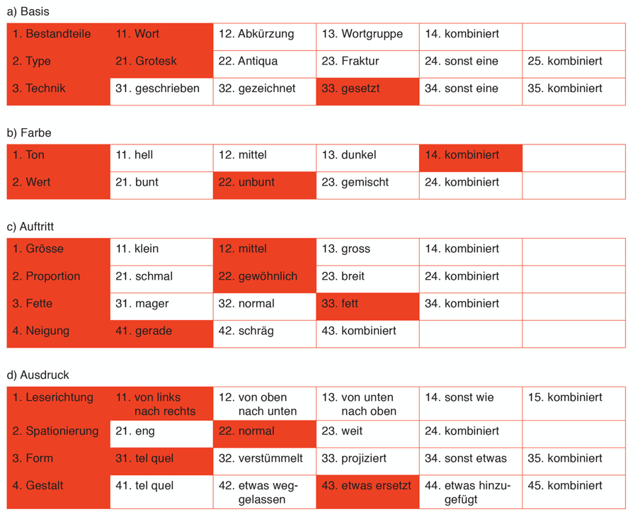

# Variablen und Parametrisierung von Formen

Ein grosser Reiz von Creative Coding besteht darin, dass Formen parametrisiert werden können. Was heisst das? 
Der Grafiker **Karl Gerstner** schreibt in «Programme entwerfen» dazu,  
_Statt Lösungen für Aufgaben, Programme für Lösungen_ seien zu entwerfen – und dass die Aufgabe zu beschreiben, einen Teil der Lösung sei. Er hat dazu einen morphologischen Kasten (unten) entworfen, in dem er Kriterien aufführt, nach denen Wortbilder, Logos aus Buchstaben zu entwerfen seien. Betrachten wir seinen morphologischen Kasten, so sehen wir darin pro Zeile mögliche Ausprägungen, so für Farbton: hell, mittel, dunkel, kombiniert.  
  

Diese Aspekte können über Variablen abgebildet und variiert werden. 

## Variablen
Wie behält ein Programm einen internen Status? Wie kann es sich Dinge merken? Um Werte aufzufangen und zu speichern, bietet JavaScript eine sogenannte Bindung oder Variable.
Eloquent JavaScript beschreibt das Konzept so:
<cite>Sie sollten sich Bindungen als Tentakel vorstellen, nicht als Kästchen. Sie enthalten keine Werte, sondern greifen sie auf - zwei Bindungen können sich auf denselben Wert beziehen. Ein Programm kann nur auf die Werte zugreifen, auf die es noch eine Referenz hat. Wenn Sie sich an etwas erinnern müssen, lassen Sie einen Tentakel wachsen, um sich daran festzuhalten, oder Sie befestigen einen Ihrer vorhandenen Tentakel wieder daran.</cite>

* <a href="https://thecodingtrain.com/tracks/code-programming-with-p5-js/code/2-variables/2-define-variables">Daniel Shiffman Tutorial Variablen</a>
* <a href="https://eloquentjavascript.net/02_program_structure.html " target="_blank">Eloquent JavaScript, vertiefte Einführung zu Variablen</a> 

### Eine Variablen erstellen und verwenden
Diese Variablen werden zuerst definiert, indem ihr einen Namen festlegt. Den Namen könnt ihr frei wählen, aber er sollte informativ gewählt werden, damit andere Programmiererinnen, die den Code lesen, verstehen, wofür die Variable gebraucht wird. Brauche ich also eine Variable für den Durchmesser von einem Kreis, so nenne ich die Variable `durchmesser`. Für die Deklaration braucht ihr das Schlüsselwort `let` – vollständig ist die Deklaration so
`let durchmesser;`  
Diese Variable ist nun deklariert, aber sie hat noch keinen Wert, sie ist `undefined`. Wenn ihr sie benutzen wollt, so kommt eine Errormeldung. Um sie zu benutzen, müsst ihr also noch einen Wert zuweisen.  
`durchmesser = 30;` 
Die Wertzuweisung erfolgt von rechts nach links. Der Wert rechts vom Gleichheitszeichen steht dann in der Variable, hier wird die 30 in `durchmesser `geschrieben. Hinterher kann ich die Variable (`durchmesser`) wie eine Zahl benutzen. 
Wir haben nun eine Variable deklariert und ihr einen Wert zugewiesen. 
Das lässt sich aber auch in einem einzigen Schritt machen: 
`let durchmesser = 30;` 
Hier findet ihr Beispielcode einer Anwendung: [Beispiel Variable](https://editor.p5js.org/hzuellig/sketches/WKx2TRLWo)

### Exkurs
Vielleicht erinnert ihr euch an Platzhalter aus dem Mathematikunterricht: x + 1 = 5; und dann musste man herausfinden, welchen Wert x hat. Es ist wichtig, zu verstehen, dass Variablen in der Programmierung etwas anderes sind! Eine Variable kann ihren Wert ändern! Ihr füllt sie mit einem Wert und diese Füllung könnt ihr laufend ändern. Wenn ich schreibe: 
`let durchmesser = 30;` 
`durchmesser = durchmesser + 30;` 
So etwas wäre in Mathematik Unsinn. In der Programmierung bedeutet es aber, dass der Wert der Variable `durchmesser `hinterher 60 sein wird. Nach Zeile ist ist er 30 (der Wert 30 wird von links nach rechts in die Variable geschrieben). In Zeile 2 werden zum bisherigen Wert (30) nochmals 30 hinzugezählt (=60). Das Resultat dieser Operation wird wieder in die Variable durchmesser links geschrieben.  

***
**Todo:**
Betrachtet das Beispiel [Beispiel Variable](https://editor.p5js.org/hzuellig/sketches/5nAuvxsGv) 
* Auf Zeile 10 wird eine Variable deklariert und mit dem Wert 0 befüllt.
* Auf Zeile 13 wird diese Variable a für die x-Koordinaten der Ellipse verwendet.
* Auf Zeile 16 wird 60 hinzugezählt. `a+=60;` ist eine Kurzschreibweise für `a=a+60;`
* Auf Zeile 18 wird diese Variable a für die x-Koordinaten der Ellipse verwendet.
* etc.  

Beachte, dass die Zeichenbefehle immer dieselben sind. Was sich ändert, ist der Wert der Variable.  
Macht eine Kopie dieses Beispiels. Erstellt eine zweite Variable `durchmesser` und verändert sie vor jedem Zeichenschritt. Benutzt die Variable durchmesser statt des fixen Werts 90. 
Weiterführend: baue ein eigenes Beispiel mit Variablen, Parametrisierung und Wiederholung von Formen.