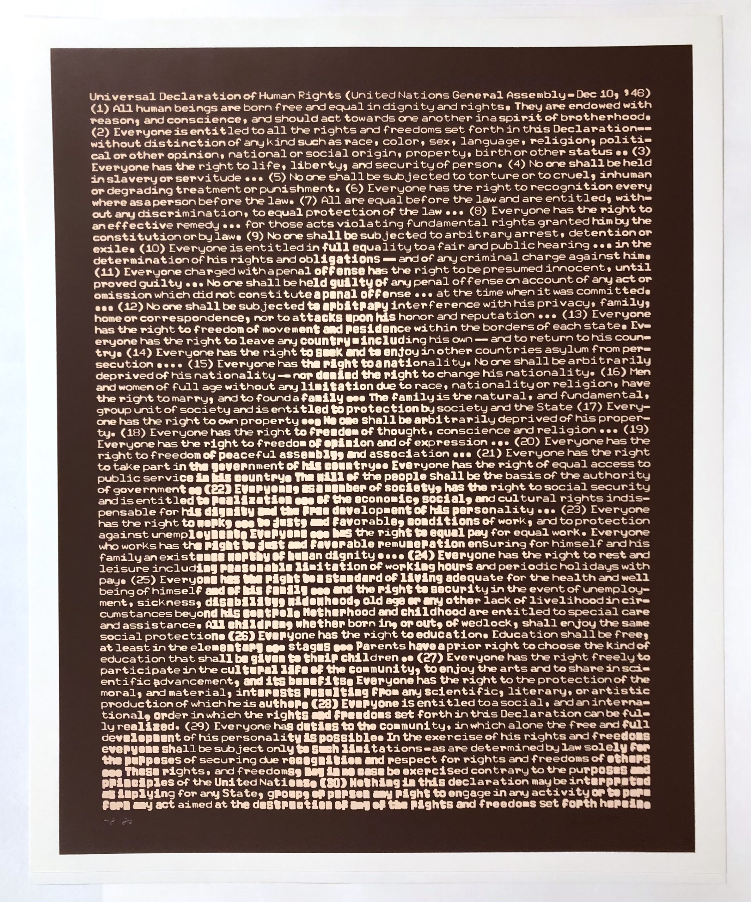

# Arrays, Pixels
## Erklärungen zum Pixel Array 
<a href="https://docs.google.com/presentation/d/104VbNZyDklRJWsJmG86VUrvtpTb2S4PbhuwkliPYxVI/edit?usp=sharing" target="_blank">Slides </a>

## Some Artwork

<br/>
Kenneth C. Knowlton <br/>
http://dada.compart-bremen.de/item/artwork/1267 <br/><br/><br/>


<br/>
Joan Truckenbrod, on becoming<br/><br/>

<br/>


<br/>
David Szauder, http://www.davidarielszauder.com/failed/eoc1leu40l2tb4f6mdbxpd9a9seoi6 <br/>

## Exercise 1 Manipulate Pixels
<a href="cindy-small.jpg">Testbild laden</a>

```js
//load an image https://p5js.org/reference/#/p5/loadImage
//function preload stellt sicher, dass ressourcen geladen sind, wenn draw startet
let img;
function preload() {
  img = loadImage("cindy-small.jpg");
}

function setup() {
  createCanvas(img.width, img.height);
  image(img, 0,0);
}

function draw(){
    if(frameCount%100 == 0){
    // loadPixels https://p5js.org/reference/#/p5.Image/loadPixels

    // loop through Pixel Array 

    // change Pixels in some way, for exp. swap red and blue channel
    // Color data is stored [r,g,b,a]

    // updatePixels https://p5js.org/reference/#/p5.Image/updatePixels

    // display updated image https://p5js.org/reference/#/p5/image

    }
    
}

```
@Todo: versuche andere Kanäle zu manipulieren, tausche die Werte von Pixeln etc.

## Exercise 2 Copy Parts of Image on mouseClick

```js
// event mouseClick https://p5js.org/reference/#/p5.Element/mouseClicked
// createGraphics https://p5js.org/reference/#/p5/createGraphics
// copy Parts https://p5js.org/reference/#/p5.Image/copy 
// manipulate copy in some way
```
<a href="https://editor.p5js.org/hzuellig/sketches/dCWv-IqKI" target="_blank">HINT</a>
@Todo, Explore: https://www.youtube.com/watch?v=TXeG_GPBs0M 
Check Examples, z.Bsp. http://www.generative-gestaltung.de/2/sketches/?01_P/P_4_1_2_02
Baue deine eigene Störung/Transformation 


## Exercise 3 Simple Edge Detection

```js
//define threshold value
//load Pixels
//loop through pixels and compare brightness with neighbours brightness
//neighbours left, right, top,bottom: i-4,i+4,i-img.width*4, i+img.width*4

function detectEdge() {

  img.loadPixels();

  for (let i = 0; i < img.pixels.length; i += 4) {
     // Color data is stored [r,g,b,a][r,g,b,a]
    let c = color(img.pixels[i], img.pixels[i + 1], img.pixels[i + 2], img.pixels[i + 3]);
    let b = brightness(c);

    //todo: Get the values of the surrounding pixels
    //left, right, top,bottom
    // compare brightness 
  }

}

/*
me index of center pixel
b brightness of center pixel
neighbours array 
*/
function compareBrightness(me, b, neighbours) {
  for (let n = 0; n < neighbours.length; n++) {
    if (neighbours[n] > 0 && neighbours[n] < img.pixels.length - 1) {
      let i = neighbours[n];
      
      //todo get color and brightness of neighbour 
      //compare with b 
      //get difference with abs() https://p5js.org/reference/#/p5/abs
      //plot point if difference is greater than threshold value
  
    }
  }
}

```
<a href="https://editor.p5js.org/hzuellig/sketches/ZxjfOhXMU" target="_blank">HINT</a>
Build something based on edge detection


## Tutorials 
* Image Processing in p5.js https://idmnyu.github.io/p5.js-image/Filters/vid_filter.html
* Erklärung Pixel Array: https://creative-coding.decontextualize.com/video/
* Edge Detection Sobel Filter: https://idmnyu.github.io/p5.js-image/Edge/index.html
* Pixel Sorting https://www.youtube.com/watch?v=JUDYkxU6J0o
* Example Pixel Sorting: https://editor.p5js.org/codingtrain/sketches/zxruKuft9
* Sortieralgoritmen https://studyflix.de/informatik/sortieralgorithmen-1337

## Tools Glitching
* https://snorpey.github.io/jpg-glitch/ Quellcode: https://github.com/snorpey/jpg-glitch
* P5 Glichting Library https://github.com/ffd8/p5.glitch 
* Text Editor für Bilder https://download.cnet.com/0xED/3000-2247_4-92701.html

