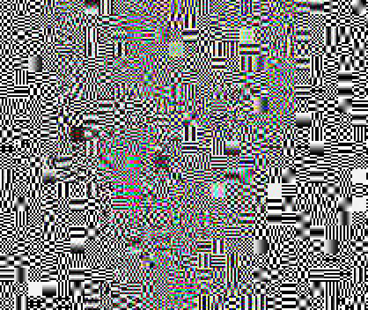
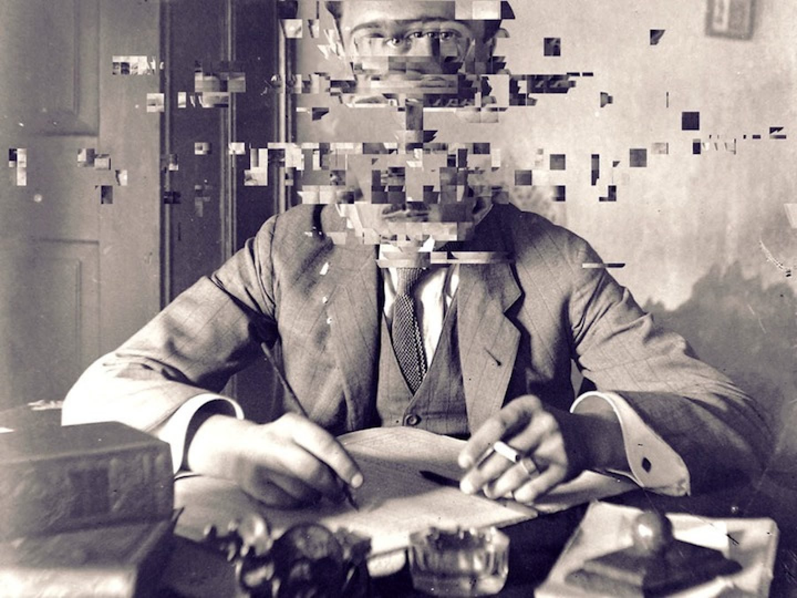
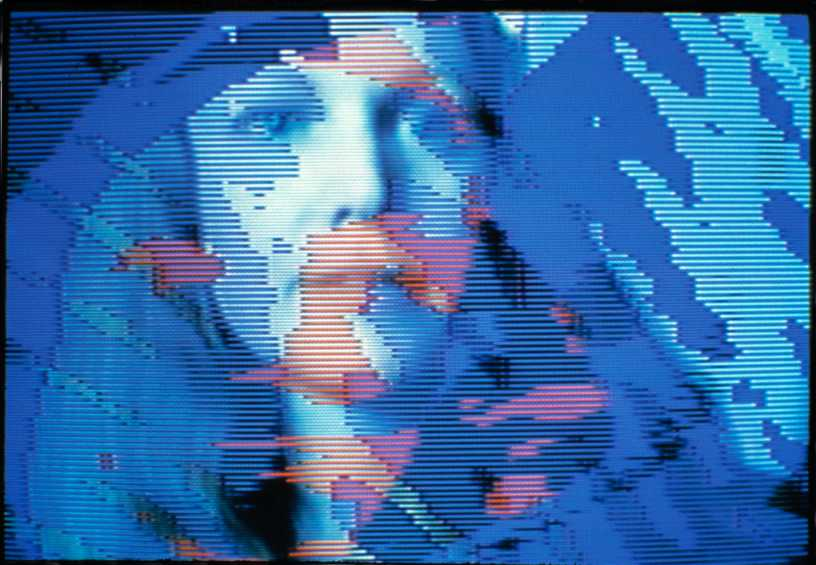

# Löchrige Bilder 
  

## Glitches, Kompression 

 
Quelle: https://ucnv.org/jpegsinyourbrain/   

Arbeite durch <a href="Sonification_&_databending_RAW_files.pdf" target="_blank">das Tutorial von Rosa Menkman</a>. Darin zeigt sie, wie man Bilder als Raw Data speichert, mit einem Sound Algorithmus komprimiert und wieder als Bild öffnet. 

### Tools Glitching
* https://snorpey.github.io/jpg-glitch/ Quellcode: https://github.com/snorpey/jpg-glitch
* P5 Glichting Library https://github.com/ffd8/p5.glitch 
* Text Editor für Bilder https://download.cnet.com/0xED/3000-2247_4-92701.html

*** 

## Copy!

 
Quelle: David Szauder, http://www.davidarielszauder.com/failed/eoc1leu40l2tb4f6mdbxpd9a9seoi6  
 

(Basis Kenntnisse in p5.js von Vorteil) 
* <a href="https://p5js.org/reference/#/p5.Image/copy" target="_blank">copy auf der p5 Referenz</a>

* Ein einfaches p5.js Beispiel zu copy findest du <a href="https://editor.p5js.org/hzuellig/sketches/58wu8M8pt" target="_blank">hier </a> 
* Mehr Beispiele <a href="http://www.generative-gestaltung.de/2/" target="_blank">Generative Gestaltung, Sektion Bild (Anfang)</a> 
* Arbeite dich durch das Tutorial zu der <a href="https://timrodenbroeker.de/shiffman-copy/" target="_blank">Copy Function von Daniel Shiffman </a>

 
 

*** 

## Pixel, Pixel

 
Quelle: Joan Truckenbrod, on becoming  

(Basis Kenntnisse in p5.js von Vorteil) 
* Ein einfaches p5.js Beispiel https://editor.p5js.org/hzuellig/sketches/dCWv-IqKI
* <a href="https://www.youtube.com/watch?v=nMUMZ5YRxHI&list=RDCMUCvjgXvBlbQiydffZU7m1_aw" target="_blank">Tutorial</a>
* Mehr Beispiele <a href="http://www.generative-gestaltung.de/2/" target="_blank">Generative Gestaltung, Sektion Bild (ab P_4_3_1_01)</a> 
