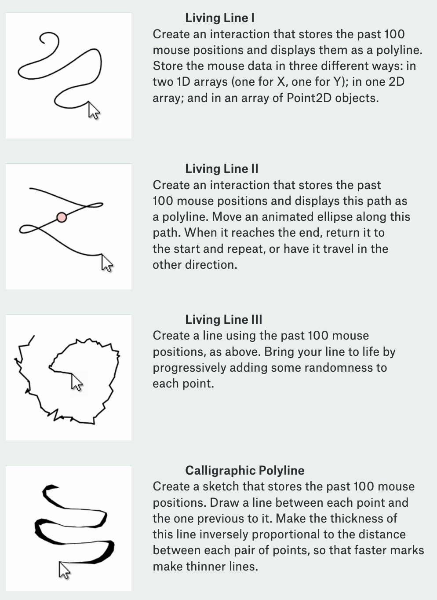
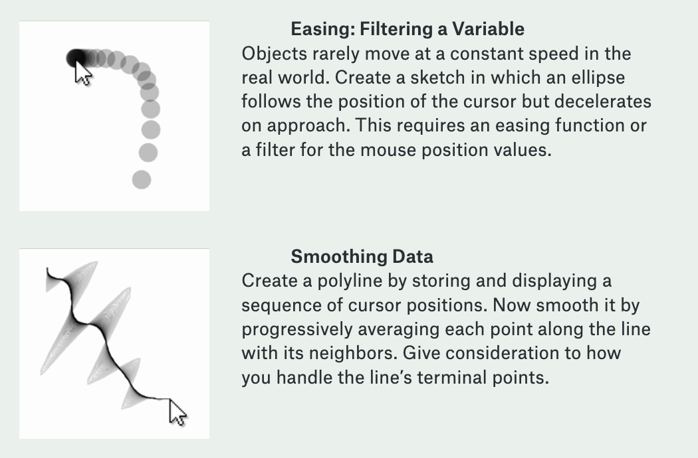
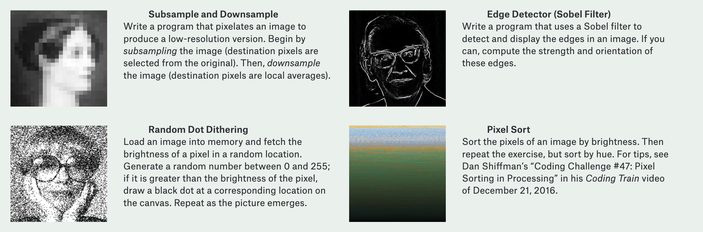
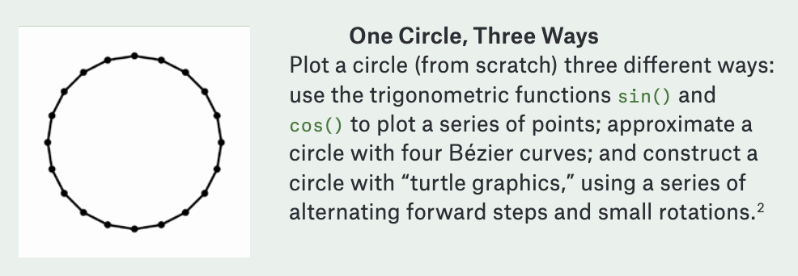
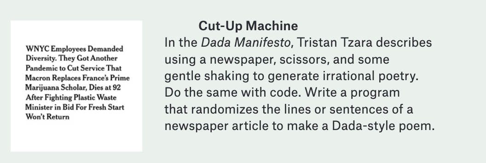
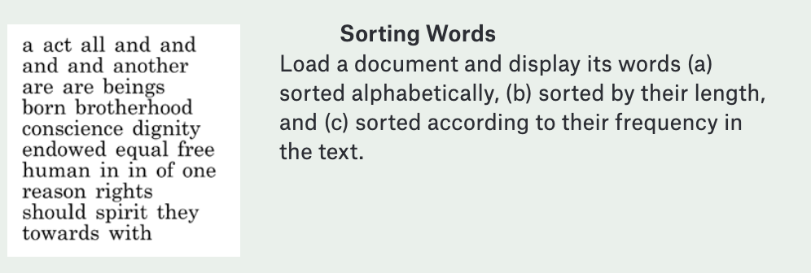
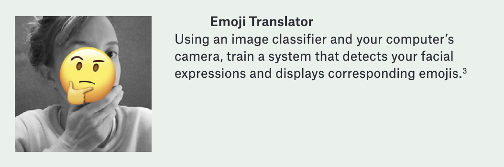

# p5 Exercises

Exercises aus Levin, G., & Brain, T. (2021). Code as creative medium: a handbook for computational art and design. MIT Press.

  
  
  
  
  
  
  

## Share links to your code here (publish on editor.p5js.org/)
